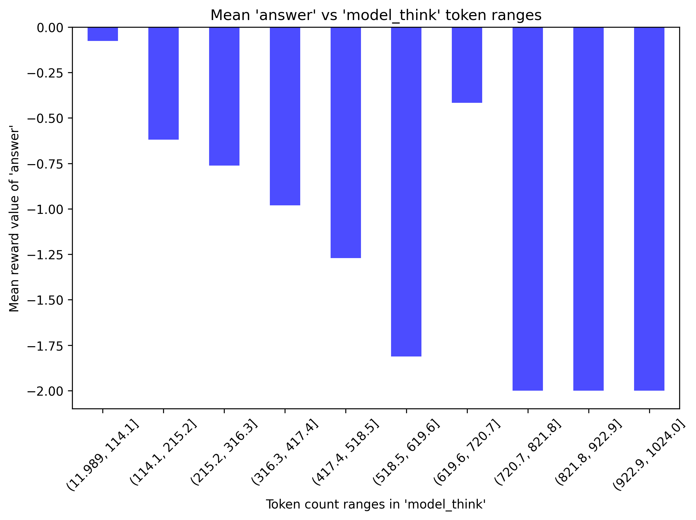
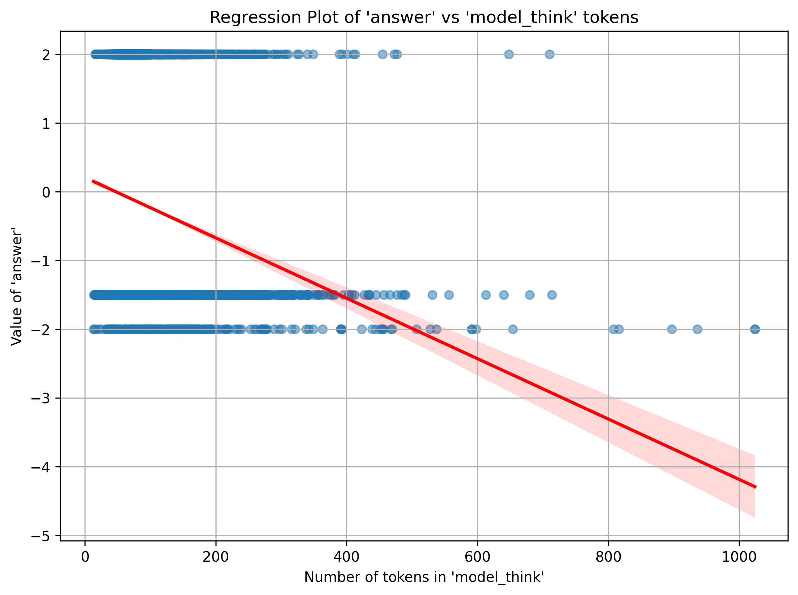

# Logic-RL-Lite: Lightweight Replication of DeepSeek-R1-Zero and Result Analysis

**Logic-RL-Lite** is a lightweight replication study of the [DeepSeek-R1-Zero](https://github.com/deepseek-ai/DeepSeek-R1) framework. This project investigates the use of **pure reinforcement learning (RL)** without supervised fine-tuning (SFT) to post-train base models for reasoning capabilities. It is a follow-up of the Logic-RL project.

It leverages the following key components:

1. RL Framework: **[veRL](https://github.com/volcengine/verl)**
2. RL Algorithms: [**REINFORCE++**](https://arxiv.org/html/2501.03262v1) and [**GRPO**](https://arxiv.org/abs/2402.03300)
3. RL Dataset: **[Knights and Knaves (K&K) Logic Puzzle Dataset](https://github.com/AlphaPav/mem-kk-logic)**
4. Base Models: Qwen2.5 (3B), Llama3.2 (3B)

---

## Dataset

**Knights and Knaves (K&K) Logic Puzzle**: Imagine there are two types of people: **Knights** and **Knaves**. Knights always tell the truth. Knaves always lie.  

The K&K dataset is designed to test logical reasoning capabilities by presenting puzzles involving statements made by multiple "people," where the goal is to determine who is a knight and who is a knave based on the given clues.

---

## Rule-Based Rewards
1. **Format Reward**: Yes
2. **Answer Reward**: Yes
3. Language Consistency Reward or Others: No

---

## Training
After configuring your WandB, GPUs, and other settings, execute the training:  
```bash
bash run_rl_trainer_xxx.sh
```

---

## Key Findings

For more visualized details, refer to my WandB report:  
**[Logic-RL-Lite Training Report](https://api.wandb.ai/links/yuwang91-hk/xevkhi9d)**

Note: The findings may be specific to the experiment setups.

### 1. **Smallest Model Capable of Learning Reasoning**
- **1.5B Models and Smaller**:
  - Instruction-tuned or pretrained models cannot learn reasoning.
- **3B Models**:
  - **Instruction-tuned models** (e.g., Qwen2.5-3B) can learn reasoning.
  - **Pretrained models** (e.g., Llama3.2-3B) struggle to learn reasoning.
- **7B Models and Larger**:
  - Consistently learn reasoning.

---

### 2. **Base Model Selection Matters**
- Cognitive differences between **Qwen2.5-3B** and **Llama3.2-3B** are discussed in [this paper](https://arxiv.org/abs/2503.01307).  
- Qwen2.5-3B demonstrates stronger instruction-following behavior compared to Llama3.2-3B. 
- Llama3.2-3B suffers from repetition.

---

### 3. **No "Aha Moment" During Pure RL**
- Self-reflection and rethinking behaviors **appear at epoch 0** (or even step 0) in **instruction-tuned base models**.
- These behaviors likely stem from **instruction tuning**, rather than emergent properties of pure RL.
- See findings from [OAT-ZERO](https://github.com/sail-sg/oat-zero) and [Logic-RL](https://github.com/Unakar/Logic-RL).

#### Table: Appearance of Self-Reflection, Verification and Summarization Keywords During Training (Base Model = Qwen2.5-3B-Instruct)

| Word           | First Occurrence (epoch, step) | Instances Found | Percentage (%) |
|----------------|--------------------------------|----------------|----------------|
| rethink        | N/A                            | 0              |           0.00 |
| re-think       | N/A                            | 0              |           0.00 |
| think again    | N/A                            | 0              |           0.00 |
| retry          | N/A                            | 0              |           0.00 |
| re-try         | N/A                            | 0              |           0.00 |
| try again      | N/A                            | 0              |           0.00 |
| recheck        | (0, 1)                         | 9              |           0.04 |
| re-check       | N/A                            | 0              |           0.00 |
| check again    | (0, 1)                         | 3              |           0.01 |
| reevaluate     | (0, 5)                         | 3              |           0.01 |
| re-evaluate    | (0, 4)                         | 34             |           0.15 |
| double check   | N/A                            | 0              |           0.00 |
| double-check   | N/A                            | 0              |           0.00 |
| verify         | (0, 0)                         | 83             |           0.37 |
| summarize      | (0, 0)                         | 73             |           0.33 |
| summary        | (0, 1)                         | 251            |           1.13 |
| aha            | N/A                            | 0              |           0.00 |
| wait           | N/A                            | 0              |           0.00 |

#### Table: Appearance of Self-Reflection, Verification and Summarization Keywords During Training (Base Model = Qwen2.5-3B)

| Word           | First Occurrence (epoch, step) | Instances Found | Percentage (%) |
|----------------|--------------------------------|----------------|----------------|
| rethink        | N/A                            | 0              |           0.00 |
| re-think       | N/A                            | 0              |           0.00 |
| think again    | N/A                            | 0              |           0.00 |
| retry          | N/A                            | 0              |           0.00 |
| re-try         | N/A                            | 0              |           0.00 |
| try again      | N/A                            | 0              |           0.00 |
| recheck        | N/A                            | 0              |           0.00 |
| re-check       | N/A                            | 0              |           0.00 |
| check again    | N/A                            | 0              |           0.00 |
| reevaluate     | N/A                            | 0              |           0.00 |
| re-evaluate    | (0, 6)                         | 1              |           0.00 |
| double check   | N/A                            | 0              |           0.00 |
| double-check   | N/A                            | 0              |           0.00 |
| verify         | N/A                            | 0              |           0.00 |
| summarize      | N/A                            | 0              |           0.00 |
| summary        | (0, 11)                        | 1              |           0.00 |
| aha            | N/A                            | 0              |           0.00 |
| wait           | N/A                            | 0              |           0.00 |

---

### 4. **Longer Chain-of-Thought (CoT) is Not Always Present**
- **Longer CoT** does not consistently appear across different experiments.
- Longer CoT likely emerges only when the task is challenging, as the model may resort to memorization rather than true reasoning.
- Further experiments are required to validate this observation.  


### 5. **Longer Chain-of-Thought (CoT) ≠ Higher Accuracy**
- While CoT becomes longer and the mean rewards increase, longer CoT does not correlate with higher accuracy.
- This aligns with **superficial self-reflection** findings from [OAT-ZERO](https://github.com/sail-sg/oat-zero).

#### Figures (Base Model = Qwen2.5-3B-Instruct):
- **Left Figure**: Answer accuracy versus token count distribution.  
- **Right Figure**: Regression analysis of accuracy against token count.  

<div style="display: flex; justify-content: space-between; gap: 1px;">





</div>

---

### 6. **Language Mixing in Instruction-Tuned Models**
- **Within `<think></think>` tags**: Language mixing is more prevalent when the base model is instruction-tuned. This finding is **counter-intuitive**.  
- **Outside `<think></think>` or `<answer></answer>` tags**: Language mixing is more prevalent when the base model is only pre-trained.

#### Table: Language Distribution in Model Thinking (Base Model = Qwen2.5-3B-Instruct)
| Category               | Count | Percentage |
|------------------------|-------|------------|
| Only English           | 21636 | 96.73% |
| Only Chinese           | 0 | 0.00% |
| Mixed (English & Chinese) | 511 | 2.28% |

#### Table: Language Distribution in Model Thinking (Base Model = Qwen2.5-3B)
| Category               | Count | Percentage |
|------------------------|-------|------------|
| Only English           | 21888 | 97.85% |
| Only Chinese           | 0 | 0.00% |
| Mixed (English & Chinese) | 0 | 0.00% |

---

### 7. **REINFORCE++ Demonstrates Stability**
- **REINFORCE++** demonstrates greater stability compared to **GRPO** during training.  
- Further experiments are required to validate this observation.  
- For a technical comparison of **REINFORCE++**, **GRPO**, and **PPO**, see [this report](https://hijkzzz.notion.site/reinforce-plus-plus).

---

## Acknowledgements

This project builds upon and references several open-source works:

- **[veRL Framework](https://github.com/volcengine/verl)**: Reinforcement learning framework.
- **[Logic-RL](https://github.com/Unakar/Logic-RL)**: Reproduction of R1-Zero on logic puzzles.
- **[OAT-ZERO](https://github.com/sail-sg/oat-zero)**: Insights on reasoning with pure RL.
- **[TinyZero](https://github.com/Jiayi-Pan/TinyZero)**: Implementation of reward models and Countdown task.
- **[DeepScaler](https://github.com/agentica-project/deepscaler)**: Iterative context scaling with GRPO.
- **[Knights and Knaves (K&K) Puzzle Dataset](https://github.com/AlphaPav/mem-kk-logic)**: Logical reasoning tasks for LLMs.
